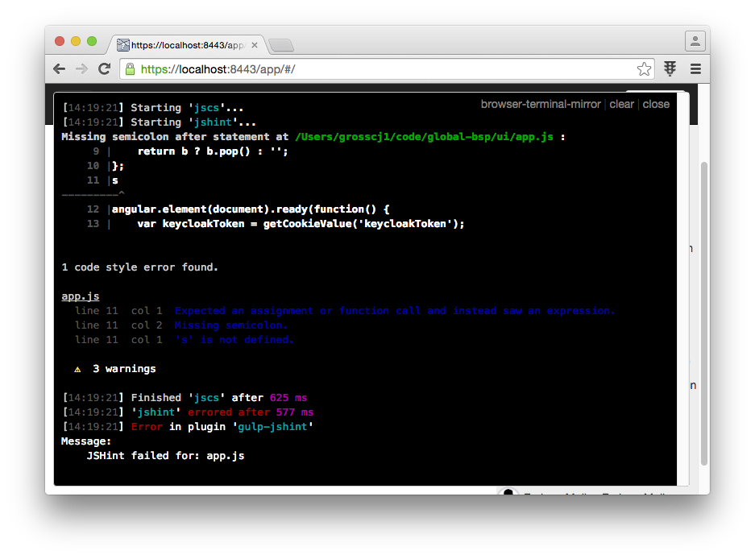

# browser-terminal-mirror

> Show terminal/console output (from Grunt, Gulp, or any node app) in your browser window

Want to see your linting errors or other _watch_ task output during development but don't wanna switch to your terminal window?  Use browser-terminal-mirror to show the output directly in your browser window.

Browser-terminal-mirror hooks into nodes stdout and mirrors all output, via websockets, to any browser pages that include the `client.js` file.



Only works in modern browsers with WebSocket support.

## Getting Started

```shell
npm install browser-terminal-mirror --save-dev
```

```js
var mirror = require('browser-terminal-mirror');

mirror({
    errorPattern: /Warning:/g //discussed below
});
```

When starting `mirror`, the `errorPattern` option is used to determine when the browser div with the console output should pop up and overlay your page.  Normally, the output is mirrored into a div that is hidden.
Only when a line is output that that matches one of the `errorPattern` regex's will the div become visible.  This is necessary since Grunt and Gulp do NOT print errors to stderr, only to stdout.  The distinct patterns
for Grunt and Gulp are the default error patterns if none are specified.

In your html file, add the following script tag during development:

```html
<script src="node_modules/browser-terminal-output/client.js"></script>
```

# API

## mirror([options]);

#### options

* `errorPattern` - A single regex or array of regex's.  Defaults to `[/Warning:/g,/errored\safter/g]`.  These are the error patterns used to determine if a Grunt or Gulp task reported an error.  If you wish to use *browser-terminal-mirror* in a regular node app, you may need to customize these regex's to only overlay the div in your browser page when appropriate to your use-case.
* `ssl` - boolean, defaults to false.
* `key` - Certificate key file.  Passed directly to `https.createServer()`.
* `cert` - Certificate file.  Passed directly to `https.createServer()`.
* `passphrase` - Certificate passphrase.  Passed directly to `https.createServer()`.

When using `ssl:true`, you'll need to add `?ssl=true` to the script src for the client.js file so the client code knows to connect using WSS.
